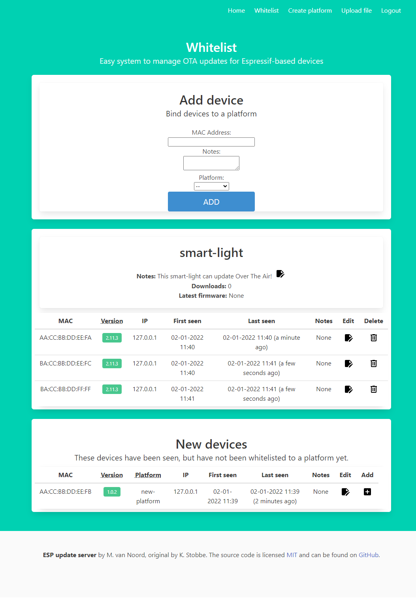

# ESP Update Server

Web-server for handling files and updating of ESP8266 and ESP32 boards.

## What Does It Do?

ESP8266 and ESP32 boards are widely popular for all kinds of tinkering projects and hacking. These boards support Over-The-Air updating, so they can be upgrade via wifi without having to physically access them.

This project provides a web-server written in Python Flask that supports this Over-The-Air updating. Furthermore, it provides a user interface where platforms can be easily managed and update binary files easily uploaded.

The main feature are:

- **Platform Names**: Each platform supported must be created on the web interface before a binary is uploaded. If an existing _platform name_ is not found in an uploaded binary it is rejected. Multiple devices can share the same _platform name_ and thus receive the same binary. Individual devices are controlled through _whitelists_ described below.
- **Semantic Versioning**: Updates are only done if a newer version of a binary is available compared to the version the device is already running. Semantic versioning is assumed e.g. v1.0.2. The uploaded binary must contain a version number starting with _v_ and three version number components i.e MAJOR, MINOR, PATCH - _v1.0.2_. An uploaded binary is rejected if such a version number is not found in the binary or if the version number is not increased compared to the one already known. 
- **Whitelists**: Download control is enforced by MAC Address whitelists. On the web interface WiFi MAC Addresses can be added and removed to created platforms. Only whitelisted devices will be allowed to update.
- **Binary Upload**: Uploading binaries is simple and administration is kept to a minimum by automatic detection of _platform name_ and _version number_. This detection helps prevent mistakes where the OTA update routine is not called or you forgot to enter a valid platform name.

## How Do I Use It?

You need to create a new admin-user to be able to access it. This can be done by running setting environment variables before running the server. You only need to do this once. If the user already exists (eg: the user used the registration form) it will be promoted to an admin-user

Linux:
```
export ADMIN_EMAIL=desired_login_email@yahoo.com
export ADMIN_PASSWORD=verysecurepassword
```
Windows:
```
SET ADMIN_EMAIL=desired_login_email@yahoo.com
SET ADMIN_PASSWORD=verysecurepassword
```
Docker:
```
docker run  --restart unless-stopped -d --name esp-update-server -v $PWD/bin:/server/bin --env ADMIN_EMAIL=desired_login_email@yahoo.com --env ADMIN_PASSWORD=verysecurepassword -p 5000:5000/tcp marcovannoord/esp-update-server:latest
```

### Start server from source

To run the server directly from sourcecode start it with the following command:

```
python -m pip install -r requirements.txt  # To install the required dependencies
export FLASK_APP=server
export FLASK_ENV=development
python3 -m flask run --host=0.0.0.0 
```

### Running with Docker

Ready-made Docker images are available on [Docker Hub](https://hub.docker.com/r/marcovannoord/esp-update-server/)

To run the server in a Docker container create a directory `bin` where you want to store the database and binaries. Then run following command from the directory where you have the `bin`-directory.  
```
docker run -d --restart unless-stopped --name esp-update-server -v $PWD/bin:/esp-update-server/bin -p 5000:5000 marcovannoord/esp-update-server:latest
```
Using the `-v` option ensures files are stored outside the Docker container and are thus persisted even if the container is terminated.

### Build docker file yourself
From the root-directory of this app, run: 
```
docker build -t esp-update-server:latest . 
``` 
to re-build the docker-image from source
To directly run this app, run
```
docker run -d --restart unless-stopped --name esp-update-server -v $PWD/bin:/esp-update-server/bin -p 5000:5000 esp-update-server:latest
```

### Device and platform management

In a web browser, when the server is running, enter the IP address of the machine running the server and port 5000, e.g. `http://192.168.0.10:5000`. Now platforms can be created Devices can be added to platforms and binaries uploaded.  
**Whitelisting devices, and assigning them to a platform**  
  

### Access Server For Update

ESP32 and ESP8266 devices requesting download of a binary file for upgrade must access path `update` and include _device name_ and current _version number_ in a query like below - substitute the IP address with your own.

```
http://192.168.0.10:5000/update?dev=smart-lamp&ver=v1.0.2
```

The server will respond with _HTTP Error Code_:
- `200` A new binary is available.
- `304` No update is needed.
- `400` or `500` An error occurred, e.g. device not whitelisted or _platform name_ is unknown.

### ESP32 Implementation

Below if an implementation for _ESP32_ that works with the server. Remember to change the IP address in the code to match your own. You can find a slightly more elaborate example in the `/examples` directory

```
#include <HTTPClient.h>
#include <HTTPUpdate.h>
#include <WiFi.h>

#define FW_VERSION "v1.0.2" # define your firmware-version here. You NEED to increase this every time
#define DEVICE_PLATFORM "SMART-LAMP" # make sure you do not change this name once chosen. It may not contain an underscore

const char* ota_update_server = "http://192.168.0.10:5000/";

/***************************************************/
void checkForUpdates(void)
{
  String checkUrl = String( ota_update_server) + String("update?dev=" DEVICE_PLATFORM "&ver=" FW_VERSION );

  Serial.println("INFO: Checking for updates at URL: " + String( checkUrl ) );

  WiFiClient client;
  t_httpUpdate_return ret = httpUpdate.update( client, checkUrl );

  switch (ret) {
    default:
    case HTTP_UPDATE_FAILED:
      Serial.println("ERROR: HTTP_UPDATE_FAILD Error (" + String(httpUpdate.getLastError()) + "): " + httpUpdate.getLastErrorString().c_str());
      break;
    case HTTP_UPDATE_NO_UPDATES:
      Serial.println("INFO: HTTP_UPDATE_NO_UPDATES");
      break;
    case HTTP_UPDATE_OK:
      Serial.println("INFO status: HTTP_UPDATE_OK");
      break;
    }
}
```

### ESP8266 Implementation

For _ESP8266_ the implementation is very similar with a few changes. Remember to change the IP address in the code to match your own.

```
#include <ESP8266HTTPClient.h>
#include <ESP8266httpUpdate.h>
#include <ESP8266WiFi.h>

#define FW_VERSION "v1.0.2
#define DEVICE_PLATFORM "SMART_LAMP"

const char* ota_update_server = "http://192.168.0.10:5000/";

/***************************************************/
void checkForUpdates(void)
{
  String checkUrl = String( ota_update_server) + String("update?dev=" DEVICE_PLATFORM "&ver=" FW_VERSION );

  Serial.println("INFO: Checking for updates at URL: " + String( checkUrl ) );
  
  t_httpUpdate_return ret = ESPhttpUpdate.update( checkUrl );

  switch (ret) {
    default:
    case HTTP_UPDATE_FAILED:
      Serial.println("ERROR: HTTP_UPDATE_FAILD Error (" + String(ESPhttpUpdate.getLastError()) + "): " + ESPhttpUpdate.getLastErrorString().c_str());
      break;
    case HTTP_UPDATE_NO_UPDATES:
      Serial.println("INFO: HTTP_UPDATE_NO_UPDATES");
      break;
    case HTTP_UPDATE_OK:
      Serial.println("INFO status: HTTP_UPDATE_OK");
      break;
    }
}
```

## TODO
- [ ] Usermanager
- [ ] Ability to delete platforms
- [ ] Better input handling/checking
- [ ] Getting it production-ready and safe
- [ ] Make compatible with AutoConnect

## Legal

Project is under the [MIT License](LICENSE.md).
